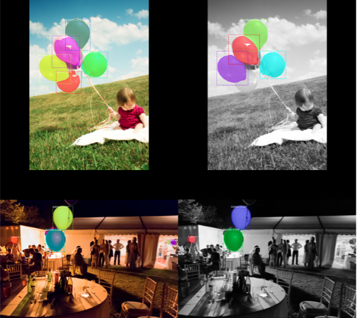
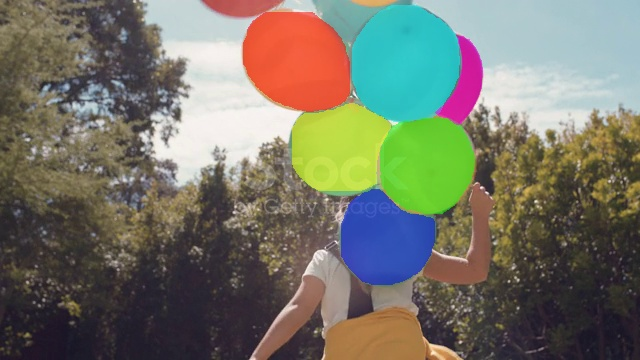
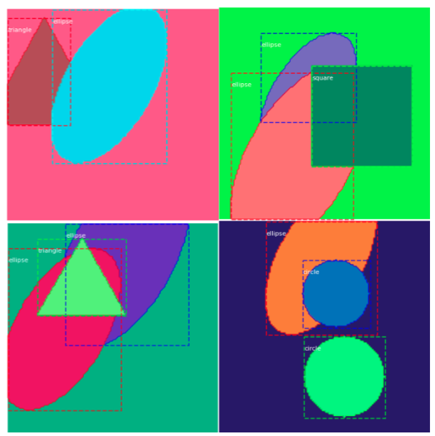

# Mask R-CNN

conda create --name mask-rcnn python=3.6

pip install -r requirements.txt

numpy
scipy
Pillow
cython
matplotlib
scikit-image
tensorflow>=2.0.0
h5py
Ipython[all]

pip install\\
opencv-python==3.4.18.65
scikit-image==0.17.2
matplotlib==3.3.4
cython==3.0.2
Pillow===8.4.0
scipy==1.5.4
numpy==1.19.5

pip install pycocotools

Download the COCO test dataset 2014 and mask_rcnn_coco.h5

Follow the installation procedure of [the GitHub repository](https://github.com/facebookresearch/Detectron)

## EXTENSION

### A. Instance segmentation over grayscale images
In this section, it is tried to extend the Mask R-CNN. One of
the extension projects is the balloon detection. In this project,
some RGB balloon images are collected and then annotated
with VIA (VGG Image Annotator) to have the bounding box
and segmentation mask for each object. Here, transfer learning
is applied which means that instead of training a model from
scratch, the weights of trained Mask R-CNN on the COCO
dataset are used as initial weights to train the network on the
balloon dataset. The COCO dataset does not contain a balloon
class, but it contains a lot of other images so the trained
weights have already learned a lot of the features common
in natural images, which really helps.
These obtained weights are used to detect the ballon in RGB
images. For the extension, I changed some of the images to
grayscale to see that the Mask R-CNN can detect balloons in
these kinds of images.

As shown in the Figure, Mask R-CNN is not able to detect
all balloons in grayscale images. In the grayscale images, if
the intensities of balloons and backgrounds are close to each
other so that it is hard to distinguish between them in grayscale
images, this network is unable to detect the balloon in this
challenging condition. It is shown that detecting the small size
of balloons is also difficult for Mask R-CNN.

### B. Instance segmentation over video
Mask R-CNN is also can applied to the video. For this
purpose, I have tried to find a video having balloons in it. Then,
the fps (frame per second) of the video is computed, and then it
is converted to a list of images. The pre-trained Mask R-CNN
over balloon dataset is used over this list and the segmentation
mask is applied to them. Then, images with object masks are
obtained. Thus, the color splash effect can be applied to them
in such a way that a grayscale version of the image is created,
and areas marked by the object mask are copied back to the
color pixels from the original image. The video that I made by
applying Mask R-CNN segmentation and color splash effect is
available in https://youtu.be/fqo2Y44vT g. The original video
is in https://youtu.be/QvaRmEZaUuU. The one frame of this
video is shown in this figure.

You can see the original video as an input [here](https://youtu.be/QvaRmEZaUuU?si=-5fGQDThSIE3fHSK) and the video output after applying the mask R-CNN [here](https://youtu.be/fqo2Y44vT_g?si=H5_u0JNbL-hZ1dn-)

### C. Mask R-CNN trained on shapes dataset
Mask R-CNN which is already trained on the COCO dataset
is used to train on the shapes dataset. For this purpose, the
weights trained on MS COCO are used to train a model on
the synthetic shapes dataset (squares, triangles, circles and
ellipses) which enables fast training. For generating the shapes
synthetic dataset, it uses OpenCV to draw different geometric
shapes within the given height and width boundaries. This
method generates images on the fly and no file access is
required.
The codes for generating the different shapes in OpenCV
just need the corner points of the rectangle and triangle, the
center point of the circle and ellipse with axes lengths of
ellipse, and the radius of the circle. This model is trained on
the new shapes dataset to detect and segment these shapes. The
performance of this network is illustrated in this figure. 

 

As Mask R-CNN has already trained the features of different objects in
the MS COCO dataset and these shapes datasets are simple,
it is just enough to train the head layers and freeze all the
backbone layers.

